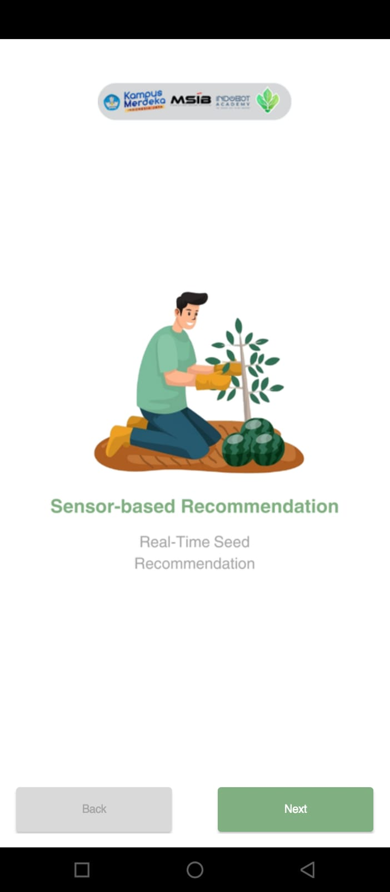
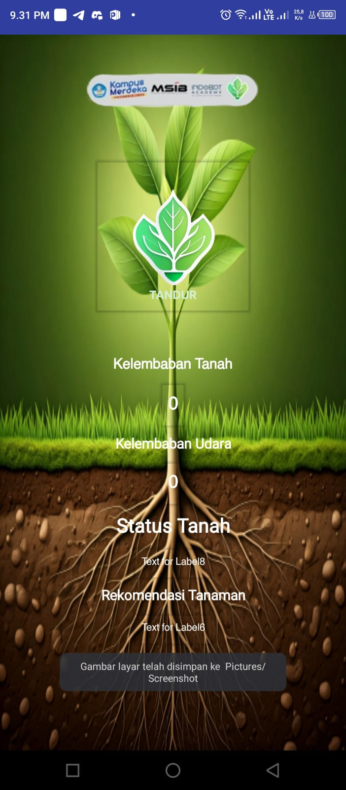

# 🌱 Smart Farming IoT System – Soil & Environmental Monitoring with Firebase + Kodular App
IoT project for monitoring soil moisture and temperature using ESP32, Firebase, and Kodular.)

# 📌 Deskripsi Singkat
Proyek ini adalah sistem monitoring kelembapan tanah, suhu, dan kelembapan udara berbasis ESP32, yang terintegrasi dengan Firebase Realtime Database dan menampilkan data secara real-time melalui aplikasi mobile buatan Kodular. Sistem juga dilengkapi fitur rekomendasi tanaman berdasarkan tingkat kelembapan tanah.

# 🚀 Fitur Utama
📡 WiFi Manager berbasis Web (LittleFS + AsyncWebServer) untuk konfigurasi SSID & Password tanpa coding ulang

🌡️ Pembacaan suhu & kelembapan udara menggunakan sensor DHT11

🌾 Pembacaan kelembapan tanah menggunakan sensor analog Soil Moisture

🔥 Data dikirim ke Firebase Realtime Database

📱 Aplikasi mobile buatan Kodular untuk menampilkan data secara real-time

🌿 Rekomendasi tanaman otomatis berdasarkan kondisi kelembapan tanah

# 📷 Gambar

📸 **Tampilan firebase**


📸 **Tampilan aplikasi Kodular**
<p align="left">
  
  
  
</p>

# 🔧 Hardware & Komponen
ESP32

Sensor DHT22

Sensor Soil Moisture capasitive

Breadboard, kabel jumper

WiFi

Kodular app (APK)
# 📡 Arsitektur Singkat
```
[Sensor DHT11 & Soil Moisture] --> [ESP32] --> [Firebase Realtime DB] --> [Kodular App]
```

## 🧠 Logika Rekomendasi Tanaman
```
< 30%       : Kering → Tidak ada rekomendasi
30–49%      : Cukup kering → Tomat
50–60%      : Lembab → Kecipir, Buncis
61–70%      : Lembab → Gambas/Oyong
71–80%      : Basah → Terong, Kacang Tanah
81–90%      : Sangat Basah → Kubis
> 90%       : Jenuh Air → Tidak ada rekomendasi
```

## 🧾 Cara Pakai
1. Upload sketch ke ESP32 via Arduino IDE

2. Jalankan board, buka WiFi dan konek ke SSID TANDUR_INDOBOT

3. Masukkan SSID & Password WiFi kamu lewat web manager

4. Setelah terkoneksi, buka aplikasi Kodular dan lihat data sensor real-time
